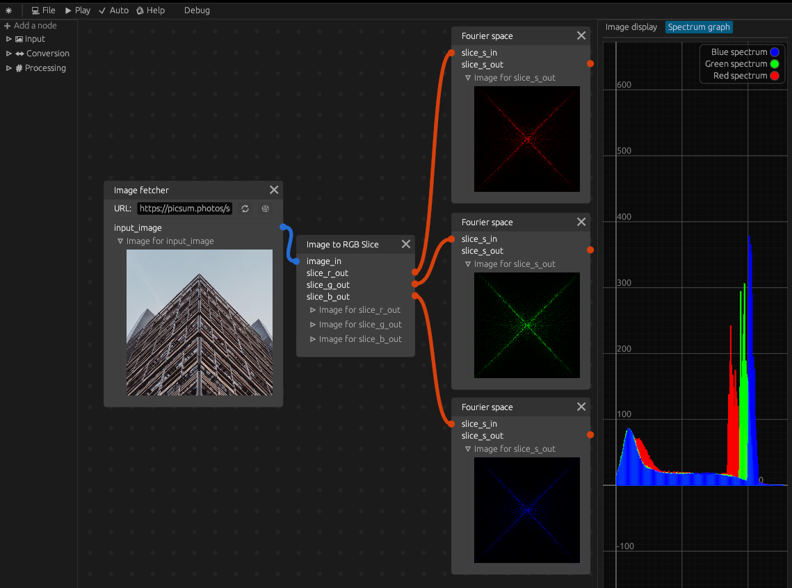

# carbaseus

[](https://deps.rs/repo/github/mlhoutel/carbaseus)
[](https://deps.rs/repo/github/mlhoutel/carbaseus)
[](https://github.com/mlhoutel/carbaseus/projects/1)
[](https://github.com/mlhoutel/carbaseus/actions?workflow=CI)
[](https://github.com/carbaseus/Tablatures/blob/main/LICENSE)

*An online pipeline for image processing.*



```markdown
*carbaseus (feminine carbasea, neuter carbaseum)* : first/second-declension adjective

1. made of fine linen
```

Carbaseus is an application designed to be the `canvas` where you can `play and express yourself` with a [/node graph/](https://en.wikipedia.org/wiki/Node_graph_architecture) based environment for doing image processing. 

As such, it must be accessible, easy to use and exhaustive in its functionality.

**Currently, it includes 3 types of nodes/functions:**

- The `input nodes` (entry point for image datas)
- The `conversion nodes` (transform data from a type to an other)
- The `processing nodes` (apply a transformation on the datas)

You can plug all these nodes together accordingly with their `input/output type`, and experiment to discover as it goes the results of the treatments.

## Getting started

### Testing locally

Make sure you are using the latest version of stable rust by running `rustup update`.

`cargo run --release`

On Linux you need to first run:

`sudo apt-get install libxcb-render0-dev libxcb-shape0-dev libxcb-xfixes0-dev libspeechd-dev libxkbcommon-dev libssl-dev`

On Fedora Rawhide you need to run:

`dnf install clang clang-devel clang-tools-extra speech-dispatcher-devel libxkbcommon-devel pkg-config openssl-devel libxcb-devel`

For running the `build_web.sh` script you also need to install `jq` and `binaryen` with your packet manager of choice *(or with these github repos releases: [jq](https://stedolan.github.io/jq/download/) - [binaryen](https://github.com/WebAssembly/binaryen/releases/))*

### Compiling for the web

Make sure you are using the latest version of stable rust by running `rustup update`.

You can compile your app to [WASM](https://en.wikipedia.org/wiki/WebAssembly) and publish it as a web page. For this you need to set up some tools. There are a few simple scripts that help you with this:

```sh
./setup_web.sh
./build_web.sh
./start_server.sh
open http://127.0.0.1:8080/
```

- `setup_web.sh` installs the tools required to build for web
- `build_web.sh` compiles your code to wasm and puts it in the `docs/` folder (see below)
- `start_server.sh` starts a local HTTP server so you can test before you publish
- Open http://127.0.0.1:8080/ in a web browser to view

The finished web app is found in the `docs/` folder (this is so that you can easily share it with [GitHub Pages](https://docs.github.com/en/free-pro-team@latest/github/working-with-github-pages/configuring-a-publishing-source-for-your-github-pages-site)). It consists of three files:

- `index.html`: A few lines of HTML, CSS and JS that loads your app.
- `your_crate_bg.wasm`: What the Rust code compiles to.
- `your_crate.js`: Auto-generated binding between Rust and JS.